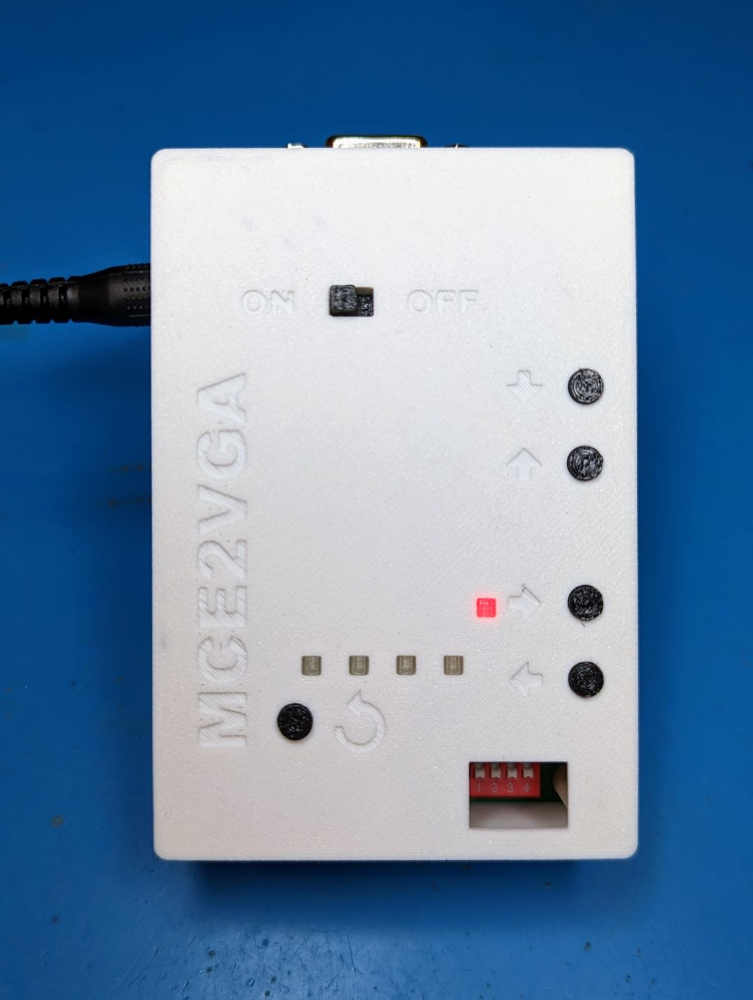
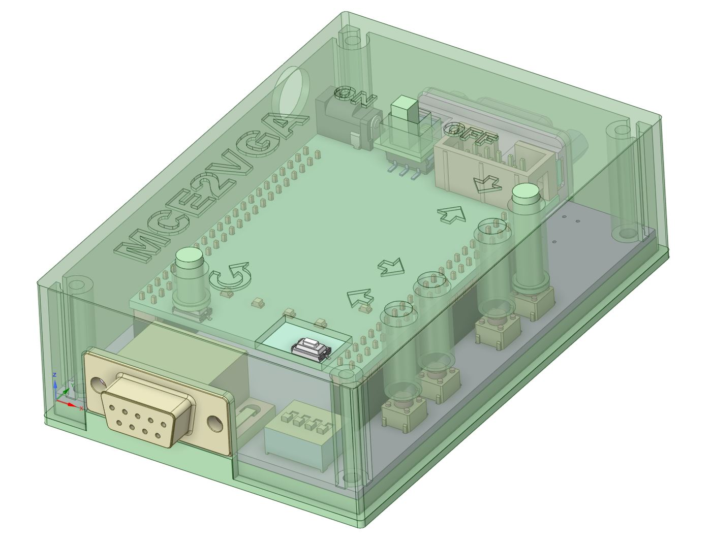

Yet another case design for the MCE2VGA version 2.0 PCB available from https://sites.google.com/site/tandycocoloco/mda-cga-ega-to-vga.  Wanted something with a more enclosed case than the current designs out there.  I did not add any cutouts for the power and status LED's since they are visible through the case walls if you print with a light colored filament. DIP switch requires a small tool like a mini screwdriver to adjust settings.

# Printing and Assembly

Optimized to print at 0.2mm layer heights with no supports needed.  Print four of the **mce2vga-button-adjust** buttons and one of everything else. Assemble with four M3x8mm (or longer) taper head screws. Clearances are tight, so you may have to drill out the button holes with a 5mm bit to get a perfect hole.

# Design Files

STEP models of the MCE2VGA and CoreEP4CE6 boards are in the **KiCad** directory.  Design was done in [DesignSpark Mechanical 6.0](https://www.rs-online.com/designspark/mechanical-software) if you want modify it further.

