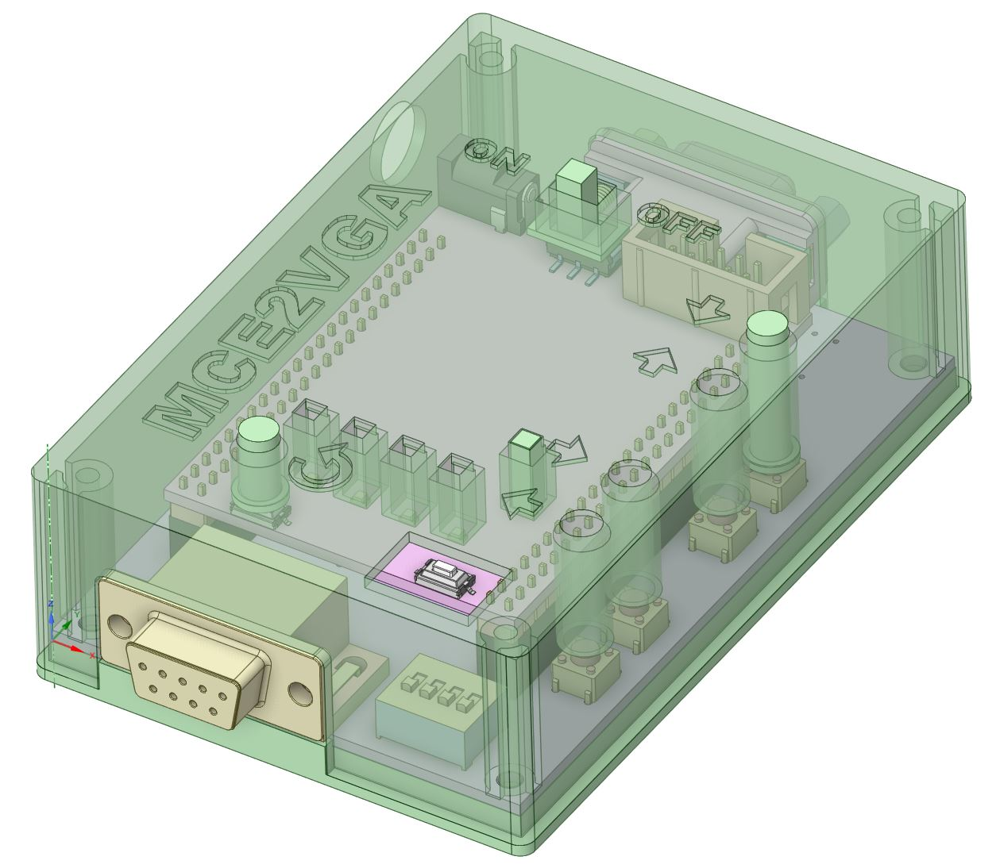

Yet another case design for the MCE2VGA version 2.0 PCB available from https://sites.google.com/site/tandycocoloco/mda-cga-ega-to-vga.  Wanted something with a more enclosed case than the current designs out there.  All required switchs, buttons, and LED's are brought to the top of case with extenders and light pipes. Only the DIP switch requires a small tool like a mini screwdriver to adjust settings.

# Printing and Assembly

Optimized to print at 0.2mm layer heights with no supports needed.  Print four of the **mce2vga-button-adjust** buttons, and five of the light pipes in a clear filament like nartural PLA, and one of everything else.  The light pipes are press fit with a small lip on the top so make sure to align them correctly in the holes. Assemble with four M3x8mm (or longer) taper head screws. Clearances are tight, so you may have to drill out the button holes with a 5mm bit to get a perfect hole.

# Design Files

STEP models of the MCE2VGA and CoreEP4CE6 boards are in the **KiCad** directory.  Design was done in [DesignSpark Mechanical 6.0](https://www.rs-online.com/designspark/mechanical-software) if you want modify it further.

